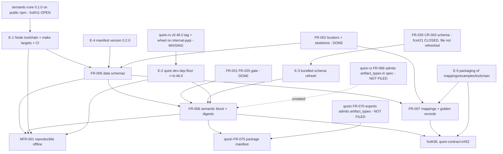

# SR-006: Dependency review of US-001, FR-005, FR-006, FR-007, NFR-001

## Summary

This analysis separates enablement from feature work across the five
`#34` documents (branch `spec/34-semantic-data-schemas`) and traces every
external delivery they lean on, checking each against the artifact that
would satisfy it today. The requirements are internally acyclic and
well-ordered (FR-005 → FR-006, FR-005 → FR-007, both → NFR-001), but four
prerequisites are outside this repository and none of them is satisfied on
the date of review: the quire wheel that carries FR-069..072 is on
`quire-rs` main only (no tag, no wheel on any index the project reads; the
test venv holds `quire 0.33.0`); `@agent-ix/semantic-core 0.1.0` resolves
from `npm.ix` only (public npm returns 404; filament-core-data#11 is open);
the bundled FR-035 schema carries no `semantic` block; and quoin's spec
and code both admit `exports` from `object_types` only, so
`quoin module install` will refuse all ten exports rather than "may". Two
of these are named in the spec, two are not. Enablement work (Node
toolchain, `make schemas*`, the schema-fixture refresh, the manifest version
bump, packaging of `mappings.yaml` and `examples/`) has no requirement of
its own and must precede FR-005. Findings FND-240..FND-253 below; verdict
in `## Verdict`.

Evidence gathered (all read-only): `poetry run pip show quire` → `0.33.0`
in the project venv; `quire --version` → `cli 0.31.0, engine 0.46.0`
(a system wheel, not the venv); `git -C quire-rs tag --contains 17b80e4`
(the #388 merge) → no tag, latest `v0.45.0`, `Cargo.toml` `0.46.0`;
`npm view @agent-ix/semantic-core --registry http://npm.ix/` → `0.1.0`,
`--@agent-ix:registry=https://registry.npmjs.org/` → 404;
`spec_artifacts_iso/module-manifest.schema.json` → zero occurrences of
`semantic`; quoin `src/semantic/manifest.ts` lines 175-189 → exports
checked against `object_types` only; quoin FR-070 → "`exports` (object-type
names …)"; `quoin --version` → `0.23.1`, which contains `3e842ce`;
quire-rs `src/loader/mod.rs` `read_module_semantic` → names from
`all_archetypes()` (artifact types admitted), while quire-rs FR-069 speaks
only of object types; quire-rs `src/extract/locator.rs` → `code_block`
with `language` and `under_section` is supported (no gap for the FR-007
`invariants` locator).

## Findings

| ID | Severity | Summary | Refs |
|----|----------|---------|------|
| FND-240 | high | The quire wheel carrying FR-069..072 does not exist as a release: quire-rs #388 landed at `17b80e4` on main, contained in no tag (latest `v0.45.0`); the project venv installs `quire 0.33.0` and `pypi.ix` lists only `0.3.x`. FR-006-AC-3 (TC-048), FR-005-AC-2 (TC-041) and NFR-001 metric 2 cannot execute on `0.33.0`, and the suite's documented stand-down pattern (pyproject comment on IT-002) would report them green. The `quire` dev-dependency floor `^0.33.0` must be raised to `>=0.46.0` **after** quire-rs tags `v0.46.0` and publishes the wheel to internal-pypi; neither the tag nor the publish is named as an upstream in any of the five documents. | FR-005-AC-2, FR-006-AC-3, NFR-001, pyproject.toml |
| FND-241 | high | `@agent-ix/semantic-core 0.1.0` is published to `npm.ix` only (public npm 404; filament-core-data#11 open). FR-005 Inputs says "from the npm registry, pinned exactly" with a committed lockfile and FR-005-CON-3 forbids a `.npmrc` in the repository; a lockfile written on the dev machine records `http://npm.ix/...` tarball URLs, and a GitHub-hosted runner cannot reach that host. Until #11 lands (or the scope registry is supplied from the CI environment, not the repo) `npm ci` in `spec_artifacts_iso/semantic/` and therefore `make schemas-check` (FR-005-AC-5, TC-042, TC-054, NFR-001 metric 1) cannot run in CI. #11 is not named as an upstream by US-001, FR-005, or NFR-001. | FR-005-CON-3, FR-005-AC-5, NFR-001, US-001 |
| FND-242 | high | The bundled FR-035 schema `spec_artifacts_iso/module-manifest.schema.json` has no `semantic` block and no `data_schema` reference form. FR-006 Inputs calls it "refreshed with … CR-003" but no requirement, task, or test owns the refresh, and three candidate sources exist (filament-core-service#21, quoin `src/semantic/schemas/module-manifest.schema.json` at `3e842ce`, quire-rs `schemas/vendored/module-manifest.schema.json`), none named as authoritative. TC-046 and TC-049 (FR-006-AC-1, AC-4, CON-1) fail on the current file. This is enablement work that must precede FR-006 and be pinned to one source by digest. | FR-006-AC-1, FR-006-AC-4, FR-001 |
| FND-243 | medium | The quoin exports gap is certain, not conditional: quoin FR-070 Behavior defines `exports` as "object-type names" and rejects any export `object_types` does not declare (FR-070-AC-4); `manifest.ts` implements exactly that. `quoin module install` on `0.23.1` will therefore emit `semantic.unknown-export` for all ten exports. FR-006 handles the diagnostic by demonstration (AC-6), but the consequence is unstated: quoin FR-075 (package manifest and registry pins derived from `exports`), listed as FR-006's downstream, is unreachable for this module until quoin amends FR-070 (a spec change, not a bug fix) and re-releases. No quoin ticket exists yet; the spec should name the ticket to be filed as a hard upstream of FR-075 consumption, not of FR-006 itself. | FR-006-AC-6, quoin FR-070, quoin FR-075 |
| FND-244 | medium | FR-006-AC-3 relies on unspecified quire-rs behaviour. quire-rs FR-069 speaks only of object types; the loader admits `artifact_types` names because `read_module_semantic` collects `all_archetypes()`, and `contract.rs` still documents its parameter as `object_types`. The admission of artifact-type exports is a code accident, not a requirement, and a conformance fix on the quire-rs side would break this module silently. A quire-rs spec change request (FR-069: "object type or artifact type") is a hidden upstream dependency. | FR-006-AC-3, quire-rs FR-069 |
| FND-245 | medium | FR-005 and FR-006 share a hidden ordering knot on the manifest `version`. FR-005 Behavior fails `make schemas` unless the `@jsonSchema` base embeds `version` from `manifest.yaml`, and FR-006 Outputs bumps that `version` to `0.2.0`, yet FR-006 `depends_on` FR-005. Sequenced naively (FR-005 first) the schemas are emitted with `$id` `.../0.1.0/...`, then FR-006 bumps the version and every digest and `$id` must be regenerated. Not a cycle, but the bump is an enablement step that belongs before FR-005, not inside FR-006. | FR-005, FR-006 |
| FND-246 | medium | Two copies of semantic-core 0.1.0 are consumed with no identity check: the TypeSpec package compiles against the npm tarball, while FR-005-AC-2 and TC-041 resolve `$ref`s against the bundle vendored by the quire wheel (quire-rs FR-069-AC-8, digest `sha256:dd33c886…`). Nothing requires the npm package's `generated/toolchain.json` digest to equal the vendored provenance digest, so the offline `$ref` resolution NFR-001 depends on can pass against bytes different from those the schemas were emitted from. | FR-005-AC-2, NFR-001, quire-rs FR-069 |
| FND-247 | medium | Packaging is an unstated enablement dependency of FR-007 and FR-005. `pyproject.toml` `include` lists `schemas/**/*.json` and `skeletons/**/*.md` only; the root `package.json` `files` lists `manifest.yaml`, `schemas/`, `skeletons/`. FR-007 says `mappings.yaml` and `examples/<type>.record.json` are "shipped with the module", and FR-005 ships `semantic/generated/toolchain.json`; none is in either payload today. Downstream #36 and quire-contract-ir#52 consume these files from the installed module, so the omission breaks the consumer, not the suite. | FR-007, FR-005, US-001 |
| FND-248 | medium | The Node toolchain has no home in a Python module repo: `Makefile` delegates every target to `poe`, has no `schemas`/`schemas-check`, and `lib-ci.yml` sets up Python only (no `setup-node`). FR-005 Outputs names the make targets but no requirement owns adding Node to the build and CI. Copying `filament-core-data/packages/semantic-core/scripts/generate.mjs` also imports a `pnpm exec biome format` step that this repo does not have. This enablement precedes FR-005 and interacts with FND-241 (registry reachability). | FR-005, NFR-001 |
| FND-249 | medium | NFR-001 metric 2 (zero network reads during `make test`) presupposes both FND-240 and FND-241 are resolved: the quire wheel with the vendored bundle must be the one installed, and `npm ci` must have completed. The NFR names neither wheel version nor registry; as written it can only be met on a machine already carrying the unreleased wheel. | NFR-001 |
| FND-250 | low | The FR-005 constraint table binds FR-005-CON-3 to `Test (TC-042)` while `tests.md` binds it to TC-054 (which is the row that actually describes the pin check). Sequencing is unaffected, but the matrix and the requirement disagree on which test gates the toolchain pin. | FR-005-CON-3, tests.md |
| FND-251 | low | FR-005 treats `spec_artifacts_iso/schemas/` as the emit target next to the ten existing `*-frontmatter.schema.json` files, and FR-005-AC-7 requires "the set of emitted schema files equals the set `toolchain.json` records". `make schemas-check` must exclude the frontmatter schemas from the "committed file the projection no longer produces" check or it fails on day one. State the directory partition (a `schemas/semantic/` subdirectory, or an explicit exclusion list). | FR-005-AC-5, FR-005-AC-7 |
| FND-252 | low | US-001 names upstreams by ticket (#35, quoin#293, quire-rs#388) and all three are CLOSED, which reads as "satisfied". Closure of the specification tickets is not delivery of the artifacts this module installs (wheel, npm package, schema file). The Dependencies section should name the deliverable and its version, not the ticket. | US-001 |
| FND-253 | low | FR-007 records `authority: markdown` and `round_trip: derived` and FR-006 declares `compatibility_posture: additive`; quoin FR-070 also admits `declared-lossy`. FR-007 declares `lossless: false` on `table`, `typed-table`, and `frontmatter` fields, which is what `declared-lossy` names. No dependency problem, but the posture must be chosen deliberately before FR-006 writes the block, because quoin FR-075 copies it into the package manifest. | FR-006, FR-007, quoin FR-070 |

## Verdict

**Not ready to plan as a single track.** The five documents form a clean DAG
among themselves, but every feature requirement is gated on at least one
external delivery that does not exist today, and the enablement work that
must precede FR-005 is unowned. Plan two tracks: an enablement track that can
start now against local artifacts (npm.ix package, locally built wheel), and
a feature track whose acceptance in CI waits on quire-rs `v0.46.0`,
filament-core-data#11, and a quoin FR-070 amendment. Three highs
(FND-240, FND-241, FND-242) must be resolved or explicitly re-scoped in the
spec before `spec-to-plan`.

## Classification

| Requirement | Class | Rationale |
|-------------|-------|-----------|
| E-1 Toolchain | Enablement (unowned) | Node + `@typespec/*` 1.15.0 + lockfile + `make schemas`/`schemas-check` + CI node setup (FND-241, FND-248) |
| E-2 Quire floor | Enablement (unowned) | `quire >=0.46.0` dev dep, after quire-rs `v0.46.0` wheel publish (FND-240) |
| E-3 FR-035 schema refresh | Enablement (unowned) | Bundled `module-manifest.schema.json` with CR-003 `semantic` block from one named source (FND-242) |
| E-4 Manifest version bump | Enablement (misfiled under FR-006) | `version: 0.2.0` before any `$id` is emitted (FND-245) |
| E-5 Packaging | Enablement (unowned) | `pyproject.toml` include + `package.json` files for `mappings.yaml`, `examples/`, `semantic/generated/toolchain.json` (FND-247) |
| FR-005 | Feature | Typed models and their JSON Schema projection |
| FR-006 | Feature | Manifest `semantic` block and digest references |
| FR-007 | Feature | Markdown mappings, golden records, reference mapping oracle |
| NFR-001 | Feature (quality) | Reproducibility and offline resolution over FR-005 + FR-006 |
| US-001 | Feature (story) | Exercised by FR-005..007 |

## Dependency Graph

Edges marked MISSING / OPEN / NOT FILED are external deliveries. Dotted
edge: dependency the spec does not state.

## Cycles

None among FR-005, FR-006, FR-007, NFR-001. The FR-005 ↔ FR-006 `version`
coupling (FND-245) is a sequencing knot, not a cycle, once the bump is lifted
into E-4.

## Sequencing

1. **Now, local only** (parallel): E-4 version bump; E-3 schema refresh from
   the quoin `3e842ce` copy pinned by digest; E-1 toolchain resolving
   `@agent-ix/semantic-core` from `npm.ix` with the scope registry supplied
   by the environment (never a repo `.npmrc`); E-5 packaging includes.
2. **FR-005** models + projection + `make schemas-check` (local green).
3. **FR-007** mappings, golden records, reference oracle (local green;
   needs only FR-005 and the existing locators).
4. **FR-006** block + digests, gated on E-2 (which is gated on quire-rs
   `v0.46.0`); until then TC-048 must fail loudly, not stand down.
5. **NFR-001** verification, gated on E-1 in CI (which is gated on
   filament-core-data#11) and E-2.
6. **Release** after X1 and X2 land; file X4 (quoin FR-070 amendment) and
   X5 (quire-rs FR-069 amendment) at step 4 so FR-075 derivation and the
   loader's admission of artifact types are specified, not accidental.

## Recommendations

1. **FR-005 Inputs** — replace "from the npm registry" with "from the
   registry the build environment configures for the `@agent-ix` scope
   (`npm.ix` until agent-ix/filament-core-data#11 publishes to npmjs.org)"
   and add filament-core-data#11 to FR-005 and US-001 Dependencies as the
   CI-enablement upstream (FND-241).
2. **FR-006 Dependencies / pyproject** — add "quire-rs `v0.46.0` wheel on
   internal-pypi" as an upstream and state that the `quire` dev dependency
   floor is raised to `>=0.46.0` in the same change; add to FR-006-AC-3 the
   clause "the test fails, and does not skip, when the installed wheel
   predates FR-069" (FND-240).
3. **New enablement requirement or FR-001 change request** — "The bundled
   FR-035 schema SHALL equal quoin `src/semantic/schemas/module-manifest.schema.json`
   at `3e842ce` byte-for-byte, recorded by SHA-256 in a test", so E-3 has an
   owner and a single source (FND-242).
4. **FR-006 Behavior** — replace "If the installed quoin refuses an export …
   then record and file" with a statement of fact: "quoin `0.23.1` refuses
   artifact-type exports (FR-070 admits `object_types` only); the module
   files agent-ix/quoin#<n> requesting FR-070 admit `artifact_types`, and
   FR-075 derivation for this module is out of scope until that lands."
   Move quoin FR-075 from Downstream to a "Blocked downstream" note (FND-243).
5. **FR-006 Dependencies** — add "quire-rs FR-069 change request: exports
   name object types or artifact types" and file it; until it lands the
   loader's acceptance is unspecified (FND-244).
6. **FR-006 Outputs → FR-005 Inputs** — move "`version` bumped to `0.2.0`"
   out of FR-006 into an enablement step listed as an FR-005 input, so the
   first projection already carries the final `$id` base (FND-245).
7. **FR-005-AC-2** — add "and the digest recorded in the npm package's
   `generated/toolchain.json` equals the semantic-core `0.1.0` provenance
   digest vendored by the quire wheel" (FND-246).
8. **FR-007 Outputs and FR-005 Outputs** — add "`pyproject.toml` `include`
   and `package.json` `files` carry `mappings.yaml`, `examples/**`, and
   `semantic/generated/toolchain.json`", with a test that the built wheel and
   npm tarball contain them (FND-247).
9. **FR-005 Outputs** — name the Node enablement explicitly: `make schemas`
   and `make schemas-check` invoke `npm ci` and `node` in
   `spec_artifacts_iso/semantic/`, and `lib-ci.yml` (or a repo-local job)
   sets up Node; drop the `biome` formatting step or add it as a pinned
   devDependency (FND-248).
10. **NFR-001 Scope** — state "the pinned quire wheel" as `>=0.46.0` and the
    `npm ci` registry as in recommendation 1 (FND-249).
11. **FR-005 constraint table** — change FR-005-CON-3 validation to
    `Test (TC-054)` to match `tests.md` (FND-250).
12. **FR-005 Outputs** — emit under `spec_artifacts_iso/schemas/semantic/`
    or list the ten frontmatter schemas as excluded from `schemas-check`
    (FND-251).
13. **US-001 Dependencies** — restate upstreams as deliverables with
    versions: "`@agent-ix/semantic-core` 0.1.0 (npm.ix today, npmjs.org via
    fcd#11)", "quire wheel `>=0.46.0` (quire-rs#388, unreleased)", "quoin
    `>=0.23.1` (quoin#293, exports gap open)" (FND-252).
14. **FR-006 Outputs** — record the reason `compatibility_posture: additive`
    is chosen over `declared-lossy` given FR-007's `lossless: false` fields
    (FND-253).
