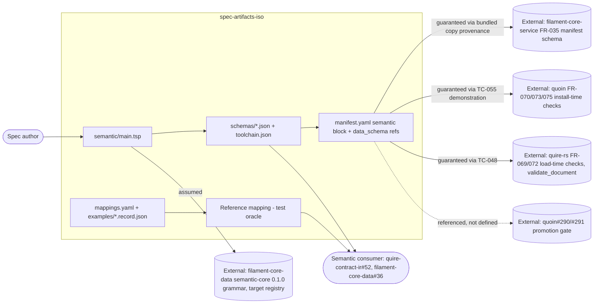

# SR-009: Scope-boundary review of the semantic data schemas and Markdown mappings (#34)

## Summary

This review defines the boundary of `spec-artifacts-iso` for ticket
agent-ix/spec-artifacts-iso#34 and allocates every responsibility the ticket
and the five new spec files touch to an owner: this module, quoin (install
time), quire-rs (load time and extraction), filament-core-data (grammar and
generated-language targets), filament-core-service (the FR-035 manifest
schema), or a later program step. It read the master spec, US-001,
FR-005..FR-007, NFR-001, the matrix rows TC-039..TC-059, the module manifest,
quoin FR-070..FR-075, quire-rs FR-069..FR-072 and the loader and
`validate_document` sources, and `packages/semantic-core/main.tsp`.

The FR-level boundaries are mostly drawn correctly: the module emits data, the
engines verify it, and FR-007 says out loud that the reference mapping is a
test oracle. Three things are wrong at the boundary. `spec/spec.md` still
describes the pre-#34 module and lists none of the required Out of Scope
items. Two ticket deliverables (generated-language fixtures, the
legacy-manifest fixture) are dropped without a named owner. And the record the
module's `data_schema` describes (the FR-007 ISO record) is not the record the
engines validate against `data_schema` (the semantic-core declaration record,
run only for `object:` archetypes), so no production component owns producing
the module's central contract.

## Verdict

**Conditional.** The five requirement files may proceed to matrix and plan
once `spec/spec.md` Scope/Out of Scope is rewritten with the owners named
below (FND-300), the two dropped deliverables are recorded as Out of Scope
with owners (FND-301, FND-304), and FR-007 states which component is expected
to implement `mappings.yaml` in production (FND-302). The medium findings are
wording and matrix annotations, not redesign.

## System Context

## In-Scope Responsibilities

- Author one TypeSpec model per ISO artifact type importing semantic-core
  0.1.0 and emit the JSON Schema 2020-12 projection (FR-005).
- Ship `toolchain.json`, `make schemas`, `make schemas-check`, and the
  reproducibility guarantee over them (FR-005, NFR-001).
- Carry the `semantic` block and one `{schema, digest}` reference per exported
  artifact type in `manifest.yaml`; fail the module's own suite on digest
  drift before any engine sees it (FR-006).
- Publish `mappings.yaml`, the golden records under `examples/`, and the
  round-trip policy (FR-007).
- Keep a Python reference mapping as a test oracle that builds the record
  from Markdown and validates it against the schema (FR-007, TC-044/045/050).
- Declare the advisory lint rule `ac-verification-method` in the manifest
  (the vocabulary declaration; the runner is quire-rs).

## External Dependencies

| Dependency | Type | Assumed or Guaranteed | Contract |
|------------|------|------------------------|----------|
| `@agent-ix/semantic-core` 0.1.0 grammar (`Identifier`, `SemanticId`, `ClauseRef`, `SourceLocus`) | npm package, TypeSpec import | Assumed | filament-core-data FR-031..FR-033, `packages/semantic-core/main.tsp` |
| Target registry (`json-schema`, `markdown` as `representationFormat`) | JSON Schema enum | Assumed | filament-core-data `schema/semantic/v1/common.schema.json` `manifestTarget` |
| `@typespec/compiler`, `@typespec/json-schema` 1.15.0 | npm devDependency | Guaranteed | TC-054 pin check, TC-056 byte-identity |
| FR-035 module-manifest schema with `semantic` block | JSON Schema, bundled copy | Guaranteed | TC-046/TC-049 over the bundled copy; provenance of the copy is NOT pinned (FND-303) |
| quoin install-time checks (unknown key, exports, digest, `$ref`, targets) | CLI | Guaranteed (manual) | TC-055 demonstration; FR-006-AC-6 |
| quire-rs load-time checks and `validate_document` | Python wheel | Guaranteed | TC-048 integration; requires a wheel carrying agent-ix/quire-rs#388 (FND-305) |
| semantic-core JSON Schema bundle vendored by quire | Files inside the wheel | Guaranteed | TC-041 offline `$ref` resolution; bundle provenance is quire FR-069-AC-8's, not this module's |
| `code_block` locator kind for the FR `invariants` locator | Engine locator DSL | Assumed | quire-rs `LocatorKind::CodeBlock` (engine 0.46.0) |
| Corpus promotion gate | Program step | Assumed | quoin#291 (measurement), quoin#290 (promotion); not defined here (FND-306) |

## Responsibility Allocation

| Responsibility | Owner | Where specified | Gap? |
|----------------|-------|-----------------|------|
| Emit the JSON Schema bundle from TypeSpec | spec-artifacts-iso (FR-005, core) | FR-005 Outputs/Behavior | No |
| Reproducible, offline projection | spec-artifacts-iso (NFR-001, infrastructure) | NFR-001, TC-056..058 | No |
| Declaration grammar (`FieldDecl`, `ClauseRef`, `SourceLocus`) and IR keyword vocabulary | filament-core-data (#34, #35) | FR-005 Inputs, FR-007 Behavior | Not listed in spec.md Out of Scope (FND-300) |
| Generated Rust/TypeScript/Python targets and their fixtures | filament-core-data (#11 semantic-core packages, #36 domain packages) | Nowhere; ticket deliverable and AC | Dropped silently (FND-301) |
| Verify `data_schema` digests, `$id`, `$ref` at install | quoin (FR-073) | FR-006 Behavior restates it | Cross-boundary wording (FND-303) |
| Verify `data_schema` digests, `$id`, `$ref` at load | quire-rs (FR-069) | FR-006-AC-3, TC-048 | Verified only through an installed wheel (FND-305) |
| Verify digests in the module's own suite before any engine | spec-artifacts-iso (FR-006-AC-5, TC-047) | FR-006 Behavior | No |
| Produce the ISO artifact record from Markdown in production | Unallocated | FR-007 says the reference mapping is a test oracle, not module code | Yes (FND-302) |
| Produce the ISO artifact record as a test oracle | spec-artifacts-iso (FR-007, cross-cutting test support) | FR-007 Outputs | No |
| Engine-side validation of an artifact-type record against `data_schema` | quire-rs (`validate_document` runs `semantic_findings` only for `object:` archetypes; the record it validates is the declaration record) | Not stated | Not listed in spec.md Out of Scope (FND-300, FND-302) |
| Verification-method vocabulary (`Verification.method`) | spec-artifacts-iso declares `ac-verification-method` in manifest.yaml; quire-rs `lint.rs` runs it; advisory | FR-005 Behavior (free text, rationale given) | No |
| Status vocabulary closure (`ArtifactStatus`) | A later sweep-and-report decision; no ticket | FR-005 Behavior | Not listed in spec.md Out of Scope (FND-300, FND-307) |
| Legacy-manifest fixture (pre-`semantic` manifest loads unchanged) | quire-rs FR-069-CON-3/AC-9 and quoin FR-073-CON-2 own the engine behavior; module fixture unassigned | Ticket deliverable; FR-006-CON-1 asserts it without a fixture | Dropped (FND-304) |
| Legacy authoring forms of `## Properties` (`legacy_forms`, `sweep_report`) | quoin FR-074 / quire-rs; this module authors no `## Properties` | FR-006 Outputs sets `legacy_forms: warning` | Declared for a form this module never produces (FND-304) |
| The quoin `semantic.exports` object-types-only gap | quoin (FR-070-AC-4); issue to be filed by this module | FR-006 Behavior, AC-6 | Diagnostic code named in AC-6 is not one quoin defines (FND-308) |
| Package-manifest derivation and registry pins from `exports` | quoin (FR-075) | FR-006 Dependencies | Export-name to model-name correspondence unspecified (FND-309) |
| FR-035 manifest schema shape and its rejections | filament-core-service (#21) | FR-006 Behavior, AC-4, TC-049 re-test it | Cross-boundary test (FND-303) |
| Corpus promotion gate; when advisory becomes enforcing | quoin (#290 promotion, #291 measurement; epic #286) | NFR-001 Verification names "the corpus promotion gate" | Not allocated (FND-306) |
| Bulk corpus rewrite | Nobody, ever (epic #286 scope rule; ticket merge gate) | Not stated in this spec | Not listed in spec.md Out of Scope (FND-300) |
| `SourceLocus` shape (`sourceIdentity`, `startColumn` required) | filament-core-data semantic-core | FR-007 ocl-clause mapping | Module cannot supply `sourceIdentity` on the `validate_document` surface (FND-310) |
| Registry that serves `@agent-ix/semantic-core` | agent-ix packaging policy (GitHub Packages / npm.ix) | FR-005 Inputs says "the npm registry" | Boundary assumption misnamed (FND-311) |

## Findings

| ID | Severity | Summary | Refs |
|----|----------|---------|------|
| FND-300 | high | `spec/spec.md` Scope, Out of Scope, Intended Users, and Requirements Architecture still describe the pre-#34 module: no TypeSpec source, emitted schemas, `mappings.yaml`, or golden records in In Scope; none of the five required Out of Scope items (generated-language fixtures, engine-side record validation, the quoin exports gap, status closure, bulk corpus rewrite) is listed; no `usecase/` or `non-functional/` class is named. | spec.md, US-001, FR-005, FR-006, FR-007, NFR-001 |
| FND-301 | high | The ticket deliverable "generated-language fixtures" and its AC "Rust, TypeScript, Python, and JSON Schema fixtures compile and validate" are dropped silently: no requirement, no Out of Scope entry, and the module cannot verify the Rust/TypeScript/Python legs itself. Owner is agent-ix/filament-core-data#11 (semantic-core packages) and #36 (domain-package compilation); FR-007 names #36 only as a downstream consumer. | FR-005, FR-007, spec.md |
| FND-302 | high | The record the module binds through `data_schema` (the FR-007 ISO record: sections, typed rows, provenance) is not the record the engines validate against `data_schema`: quire FR-069-AC-1 and quoin FR-073 validate the extracted semantic-core declaration record (`fields`, `clauses`, `operations`), and `validate_document` runs `semantic_findings` only for `object:` archetypes. FR-007 states the reference mapping is a test oracle and not module code, so no production component is allocated to implement `mappings.yaml`; each downstream consumer (quire-contract-ir#52) would reimplement it. The spec must name the owner of the production extractor or record it as Out of Scope to agent-ix/quire-rs. | FR-005-AC-4, FR-006 Description, FR-007 Outputs, quire-rs FR-069, quoin FR-073 |
| FND-303 | medium | FR-006 Behavior specifies what other components do ("quoin SHALL accept the block"; "The bundled FR-035 schema SHALL accept ... and SHALL reject ..."), and FR-006-AC-4/TC-049 re-verify filament-core-service's schema rejections instead of pinning the bundled copy's provenance (repository, revision, SHA-256) to the revision quoin vendors at 3e842ce. The module owns the copy's provenance, not the schema's semantics. | FR-006 Behavior, FR-006-AC-4, TC-049, quoin FR-070-CON-2 |
| FND-304 | medium | The ticket deliverable "legacy-manifest fixture" is dropped: FR-006-CON-1 asserts a consumer ignoring the `semantic` block loads as before, but no fixture (the 0.1.0 manifest at 3d87196) is loaded by TC-046, and no Out of Scope entry names quire FR-069-CON-3/AC-9 and quoin FR-073-CON-2 as the owners of that behavior. Separately, FR-006 sets `legacy_forms: warning` for quoin FR-074's `## Properties` legacy forms, which this module never authors; the value is inert here and should say so. | FR-006 Outputs, FR-006-CON-1, TC-046, quoin FR-074 |
| FND-305 | medium | Four criteria are verified only through components the module does not own and the matrix does not say so: FR-006-AC-6 (quoin build at or after 3e842ce, TC-055 Manual), FR-006-AC-3 (a quire wheel carrying agent-ix/quire-rs#388; the installed CLI is `quire 0.31.0 / engine 0.46.0`), FR-005-AC-2 (the semantic-core bundle vendored by the wheel, whose provenance is quire FR-069-AC-8's), and NFR-001 metric 2 (TC-057 Manual). Each row needs the dependent release named as its precondition. | FR-005-AC-2, FR-006-AC-3, FR-006-AC-6, NFR-001, TC-041, TC-048, TC-055, TC-057 |
| FND-306 | medium | NFR-001 Verification and the ticket merge gate defer to "the corpus promotion gate" that no requirement in this module defines or allocates. The owner is quoin#291 (advisory measurement) and quoin#290 (human-approved enforcement promotion) under epic quoin#286; the spec should name them and state that this module's sealed schemas are enforcing only inside its own suite until then. | NFR-001 Verification, FR-005 Behavior (sealed schemas) |
| FND-307 | low | Status-vocabulary closure is correctly left open in FR-005 but has no named owner or ticket; "a sweep-and-report decision of its own" must appear in spec.md Out of Scope as a later step, so the deferral is visible outside FR-005. | FR-005 Behavior, spec.md |
| FND-308 | low | FR-006-AC-6 admits only the diagnostic `semantic.unknown-export`, a code that quoin FR-070 does not define (FR-070-AC-4 names no code; the quire-rs analogue is `semantic.export-undeclared`). Pinning a code owned by another component that has not minted it makes the AC unverifiable as written; admit "a diagnostic naming the export" and record the code verbatim once seen. | FR-006-AC-6, TC-055, quoin FR-070-AC-4 |
| FND-309 | low | `exports` uses manifest names (`master-requirements`, `index`, `log`, `Glossary`) while the schemas are `MasterRequirements.json`, `Index.json`, `Log.json`; quoin FR-075 derives `typeIdentity ix://agent-ix/spec-artifacts-iso/type/<export name>` from the export names. The export-name to schema-file correspondence is stated nowhere, and identity derivation is quoin's. | FR-006 Outputs, FR-005 Outputs, quoin FR-075 |
| FND-310 | low | FR-005 makes `provenance.sourceIdentity` optional "because the `validate_document` surface has none", but FR-007's `ocl-clause` mapping emits `ClauseRef.sourceSpan: SourceLocus`, whose `sourceIdentity` and `startColumn` are required by semantic-core (`main.tsp`), a shape this module cannot relax. FR-007 must say what identity and column convention the oracle supplies for skeleton records and that both are owned upstream (semantic-core; quire-rs FR-071). | FR-005 Behavior, FR-007 Behavior, filament-core-data main.tsp |
| FND-311 | low | FR-005 Inputs names "the npm registry" as the source of `@agent-ix/semantic-core`; `@agent-ix` packages are served from GitHub Packages / npm.ix, not the public registry. The boundary assumption should name the registry the lockfile will resolve against, since NFR-001 allows network access only for that install. | FR-005 Inputs, FR-005-CON-3, NFR-001 Scope |

## Recommendations

1. **Rewrite `spec/spec.md` Scope (FND-300, FND-307).** Add to In Scope:
   - "The TypeSpec source under `spec_artifacts_iso/semantic/` and the emitted
     JSON Schema bundle under `spec_artifacts_iso/schemas/` with its
     `toolchain.json` (FR-005, NFR-001)."
   - "The `semantic` block and per-type `data_schema` references in the
     manifest (FR-006)."
   - "`mappings.yaml`, the golden records under `examples/`, and the Python
     reference mapping used as the test oracle (FR-007)."

   Replace Out of Scope with exactly these bullets (keep the two existing
   ones):
   - "Generated Rust, TypeScript, and Python fixtures and packages for these
     models — agent-ix/filament-core-data#11 (semantic-core packages) and
     agent-ix/filament-core-data#36 (domain-package compilation); this module
     ships JSON Schema only."
   - "Engine-side extraction and validation of an artifact-type record
     against its `data_schema` — agent-ix/quire-rs; `validate_document`
     validates semantic records only for `object:` archetypes, so this
     module's records are verified by its own reference mapping in tests."
   - "The install-time `semantic.exports` check that admits only
     `object_types` names — agent-ix/quoin (FR-070); this module records the
     diagnostic and files the issue (FR-006-AC-6)."
   - "Closing the `status` vocabulary — a later sweep-and-report decision; the
     schema admits the measured spellings (FR-005)."
   - "Bulk corpus rewrite — never; no corpus repository is edited by this
     module (epic agent-ix/quoin#286 scope rule)."
   - "Semantic-core grammar, the IR keyword vocabulary, and the target
     registry — agent-ix/filament-core-data#34/#35."
   - "The corpus promotion gate that turns advisory findings into enforcing
     ones — agent-ix/quoin#291 (measurement) and agent-ix/quoin#290
     (promotion)."

   Add semantic consumers to Intended Users and `usecase/` and
   `non-functional/` to Requirements Architecture.
2. **FND-301.** Add a sentence to FR-005 Description: "Generated-language
   projections of these models are not a deliverable of this module; they are
   produced by the filament-core-data compiler (agent-ix/filament-core-data#11,
   #36) from the same TypeSpec source." Record on the ticket that the
   Rust/TypeScript/Python AC is verified there.
3. **FND-302.** Add to FR-007 Description: "No component of this module
   produces the record at runtime. The production implementation of
   `mappings.yaml` is owned by agent-ix/quire-rs (extraction) and consumed by
   agent-ix/quire-contract-ir#52; until it exists the golden records are the
   contract." File the quire-rs issue and cite it in FR-007 Dependencies.
4. **FND-303.** In FR-006 Behavior change "quoin SHALL accept the block" to
   "the block is authored to quoin FR-070; acceptance is demonstrated by
   TC-055", and replace the two "The bundled FR-035 schema SHALL ..." bullets
   with "The bundled FR-035 schema SHALL be byte-identical to
   `filament_core_service/schemas/module-manifest.schema.json` at the
   revision quoin vendors (3e842ce), with repository, revision, path, and
   SHA-256 recorded beside it." Retarget FR-006-AC-4/TC-049 to that
   provenance check.
5. **FND-304.** Add to FR-006 Outputs: "`tests/fixtures/manifest-0.1.0.yaml`,
   the manifest at 3d87196 without a `semantic` block, which `quire.Registry`
   SHALL load to the same archetype names and `body_extraction` as the new
   manifest minus the `invariants` locator (FR-006-CON-1, TC-046)." Add a
   note that `legacy_forms: warning` governs `## Properties` forms this module
   does not author (quoin FR-074) and is the contract default.
6. **FND-305.** In `spec/tests.md` add a precondition column note or a
   sentence under Overview: TC-048/TC-041 require a quire wheel carrying
   agent-ix/quire-rs#388; TC-055 requires a quoin build at or after 3e842ce;
   TC-057 is a manual gate. Mark all four as external-contract verification.
7. **FND-306.** In NFR-001 Verification replace "the corpus promotion gate"
   with "the promotion gate of agent-ix/quoin#290, informed by the
   agent-ix/quoin#291 sweep".
8. **FND-308.** Reword FR-006-AC-6 to "fails only with a diagnostic naming
   the export as undeclared, recorded verbatim ...", and drop the invented
   code.
9. **FND-309.** Add a two-column table to FR-006 Outputs mapping each export
   name to its schema file, and a sentence that the `typeIdentity` derived
   from the export name is quoin FR-075's.
10. **FND-310.** In FR-007 Behavior state the fixed `sourceIdentity`
    (for example `ix://agent-ix/spec-artifacts-iso/skeletons/<type>`) and the
    column convention the oracle supplies for skeleton spans, citing
    semantic-core `SourceLocus` and quire-rs FR-071 as the owners.
11. **FND-311.** In FR-005 Inputs replace "from the npm registry" with the
    registry the lockfile resolves (`npm.ix` / GitHub Packages) so NFR-001's
    single allowed network access is named.
